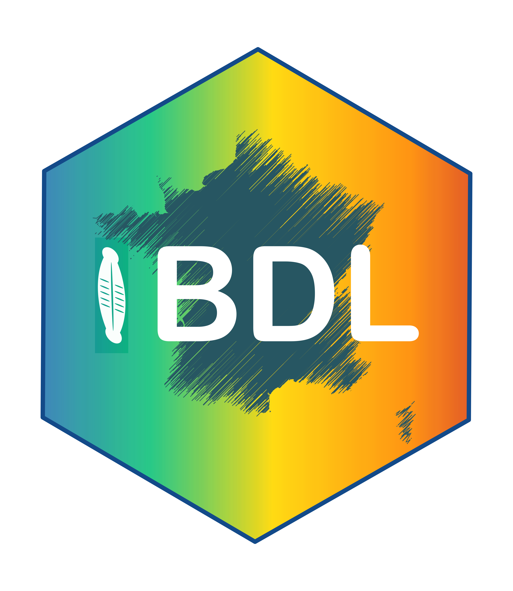
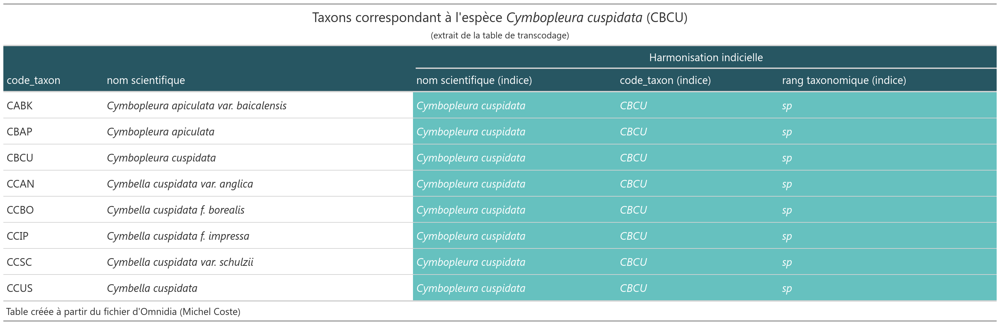
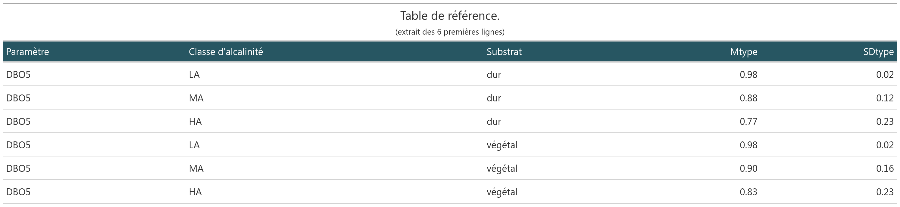
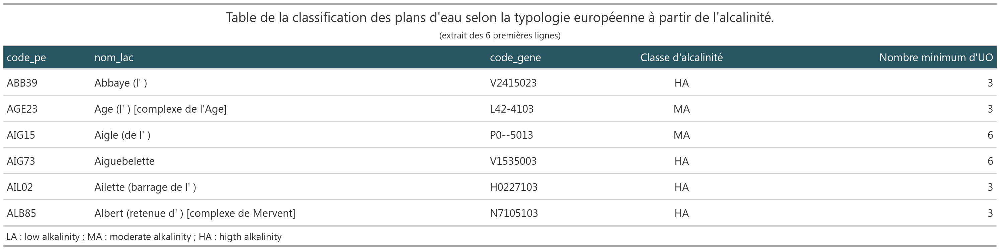
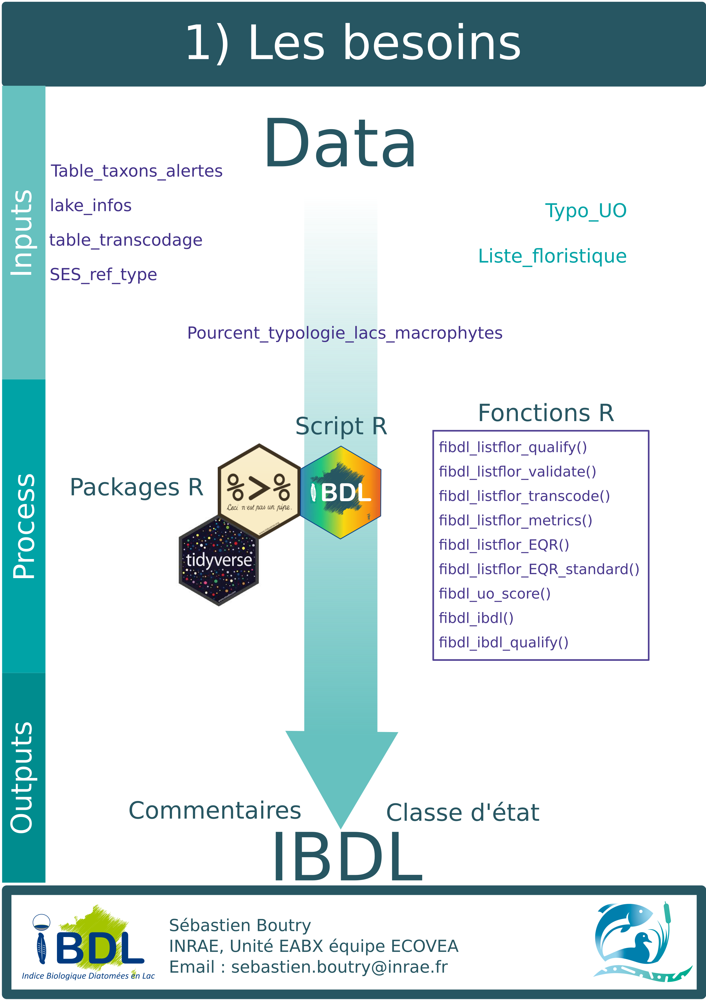
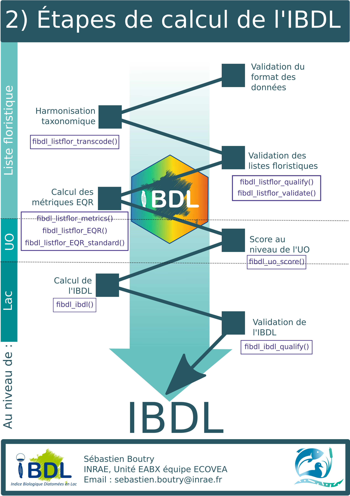

<!-- README.md is generated from README.Rmd. Please edit that file -->

# Indice Biologique Diatomées en Lac (IBDL) 

<!-- badges: start -->

[](https://www.tidyverse.org/lifecycle/#maturing)
[](commits/master)
[](https://www.gnu.org/licenses/gpl-3.0.en.html)
<!-- [](https://github.com/SebastienBoutry/IBDL/actions) -->
<!-- badges: end -->

# Installation de `{IBDL}`

La version du package `{IBDL}` peut se télécharger via le site Github
pour cela on aura besoin du package `{remotes}`:

``` r
remotes::install_github("SebastienBoutry/IBDL")
```

*NB : Le logiciel RTools est parfois nécessaire sur les machines Windows
pour pouvoir installer le package `{remotes}`, puisque l’installation
ici se fait depuis un dépôt de développement (Github) et non un dépôt
officiel R. Vous pouvez l’installer ici :
[Rtools](https://cran.r-project.org/bin/windows/Rtools/)*

Une fois installé, vous pouvez charger le package avec :

``` r
library(IBDL)
```

# Objectif

L’objectif de ce package `{IBDL}` est de fournir les fonctions
nécessaires pour calculer l’Indice Biologique Diatomées en Lac.

*NB : L’IBDL a été développé par l’équipe ECOVEA (INRAE, unité EABX)
dans le projet Phytobenthos plan d’eau financé par l’OFB-Pôle ECLA.*

# Utilisation

Le package `{IBDL}` sert à calculer l’Indice Biologique Diatomées en Lac
(IBDL) afin de donner une valeur et une classe d’état écologique au plan
d’eau étudié (conforme à la Directive Cadre Européenne sur l’Eau
(Commission 2000)).

*NB Dans le rapport scientifique (Boutry et al. 2021), les différentes
étapes de la construction de l’IBDL y est décrite.*

## Les besoins

L’Indice Biologique Diatomées en Lac s’appuie sur un protocole
d’échantillonnage décrit dans (Morin et al. 2010) et dans la norme
macrophytes plan d’eau (Afnor 2010).

Afin d’être réprésentatif de la masse d’eau, plusieurs stations sont
échantillonnés (échantillonnage stratifiée). La deuxième étape de
retranscription sur des fichiers standardisés facilite l’alimentation
des bases des données et la troisième étape consiste au calcul de
l’indice.

### Protocole d’échantillonnage

Plusieurs stations (ou unités d’observation) sont échantillonnées sur un
ou deux types de substrat (minéral/dur ou végétal). Le positionnement de
ces unités d’observation est décrite dans la norme macrophytes plan
d’eau (Afnor 2010) elle utilise la méthode de Jensen (Jensén 1977) qui a
été incrémentée dans le package
[`{lakemetrics}`](https://github.com/SebastienBoutry/diatomfrLake).

### Acquisition des données

Deux sources de “template” de fichiers de données sont disponibles
[Hydrobio-DCE](https://hydrobio-dce.inrae.fr/) et
[OFB](https://professionnels.ofb.fr/node/398). Il est conseillé
d’utiliser ce dernier.

La mise en forme des fichiers peuvent se faire à l’aide du package
[`{diatomfrLake}`](https://github.com/SebastienBoutry/diatomfrLake).

Des données mésologiques (au niveau de la campagne et l’unité
d’observation) et des listes floristiques sont acquises sont réparties
dans deux fichiers distincts :

-   le premier contient les listes floristiques (id\_prelevement,
    taxons, ab),
-   le second renseigne sur les données de contexte liées au site
    d’étude (id\_prelevement, id\_uo, nature\_substrat, code\_gene,
    date).

### Données internes embarquées

Les jeux de données internes embarquées correspondent aux jeux de
données dit de référence. Ils sont décrits ci-dessous :

**`table_transcodage`** : Table de transcodage permettant de faire
correspondre le code\_taxon 4 lettres (type OMNIDIA) à son entité
taxonomique qui a été considérée pour la construction de l’IBDL. Le
choix pour l’indice est d’harmoniser les taxons à un rang taxonomique de
l’espèce. On a pris en compte la synonymie et l’héritage taxonomique.

Dans l’extrait ci-dessous, les deux premières colonnes correspondent au
code taxon et le nom scientifique associé. Les trois dernières colonnes
sont les informations liées à la construction de l’indice. Le tableau
ci-dessous correspond à tous les taxons ayant un code taxon (indice)
pour valeur CBCU (*Cymbopleura cuspidata*).



**`table_taxons_alertes`** Table binaire indiquant si le taxon est
considéré comme indiciel et/ou d’alerte selon les paramètres (DBO5, MES,
NKJ et Ptot). Le nombre 1 indique si le taxon est considéré comme un
taxon d’alerte.


**`table_reference`** table regroupant les informations afin de calculer
les métriques au niveau du prélèvement pour chaque paramètre, type de
substrat et la classe d’alcalinité du plan d’eau.



**`table_lacs`** Table regroupant les informations sur la classification
des lacs selon l’alcalinité (Kelly et al. 2014) et le nombre minimal
théorique d’unités d’observation à échantillonner sur chaque plan d’eau
selon leur superficie (Afnor 2010).

Les classes d’alcalinité des plans d’eau sont définis comme ceci :

-   LA (basse) : alcalinité &lt;0.2 meq.l-1;
-   MA (moyenne) : 0.2 meq.l-1 &lt;= alcalinité &lt; 1 meq.l-1;
-   HA (haute) : alcalinité alcalinité &gt;=1 meq.l-1.



<div align="center">



</div>

## Les étapes

On trouve 10 fonctions dans ce package. L’une d’elle **fibdl** est une
fonction intégratrice (utilisant les 9 autres) afin de définir l’indice
IBDL. Il est possible de faire une seule partie du cheminement afin de
d’avoir les résultats intermédiaires à différentes échelles spatiales.

``` r
# ## Chargement du package
# if(!require("remotes")) {install.packages("remotes")} 
# remotes::install_github("SebastienBoutry/IBDL",force = TRUE)
# library(IBDL)

## Chemins
chemin_flore <- system.file("listflor.csv", package = "IBDL") # A remplacer par votre chemin
chemin_uo <- system.file("info_uo.csv", package = "IBDL") # A remplacer par votre chemin

### Si besoin d'aide pour les chemins, dé-commenter et exécuter ces lignes à la place pour sélectionner les fichiers via une fenêtre de dialogue
# chemin_flore <- rstudioapi::selectFile()
# chemin_uo <- restudioapi::selectFile()

## Import
listflor <- read.csv2(chemin_flore, fileEncoding = "utf-8")
info_uo <- read.csv2(chemin_uo, fileEncoding = "utf-8")

## Calcul de l'IBDL
ibdl <- fibdl(listflor,info_uo)

## Affichage des résultats
ibdl
```

<div class="kable-table">

| id\_campagne | datedebut  | code\_lac | nbr\_uo |      IBDL | Somme des Pourcentages selon la typologie | Classe d’état IBDL | nom\_lac         | code\_gene | Classe alcalinité | Fiabilite | commentaires |
|-------------:|:-----------|:----------|--------:|----------:|------------------------------------------:|:-------------------|:-----------------|:-----------|:------------------|:----------|:-------------|
|            1 | 2021-07-15 | ORX40     |       4 | 0.1739731 |                                         1 | B                  | Orx (marais d’ ) | S43-5003   | MA                | ok        |              |

</div>

<!-- Certaines fonctions permettent de :  -->
<!-- - harmoniser les données, -->
<!-- - qualifier/valider les données ou les métriques, -->
<!-- - calculer les métriques selon un grain spatial (prélèvement, unité d'observation et lac). -->

Toutes les fonctions sont détaillées dans la vignette du package.

<div align="center">



</div>

# Contact

<div align="center">

   :e-mail:
[Email](mailto:sebastien.boutry@inrae.fr)   \|   :speech\_balloon:
[Twitter](https://twitter.com/SebBoutry)   \|   :necktie:
[LinkedIn](https://www.linkedin.com/in/s%C3%A9bastien-boutry-4a77ba10/)

<!--
Quick Link
-->

</div>

# Références

<div id="refs" class="references csl-bib-body hanging-indent">

<div id="ref-afnorXP" class="csl-entry">

Afnor. 2010. “XP T90-328 Qualité de l’eau Echantillonnage Des
Communautés de Macrophytes En Plans d’eau.”

</div>

<div id="ref-Boutry2021" class="csl-entry">

Boutry, Sébastien, Soizic Morin, Vincent Bertrin, and Juliette Rosebery.
2021. “Évaluation écologique Des Plans d’eau Basée Sur Les Communautés
de Diatomées Benthiques.” INRAE, UR EABX, équipe ECOVEA.

</div>

<div id="ref-Directive2000" class="csl-entry">

Commission, European. 2000. “Water Framework Directive.” *Journal
Reference OJL* 327: 1–73.

</div>

<div id="ref-Jensen1977" class="csl-entry">

Jensén, Sven. 1977. “An Objective Method for Sampling the Macrophyte
Vegetation in Lakes.” *Vegetatio* 33 (2): 107–18.

</div>

<div id="ref-Kelly2014" class="csl-entry">

Kelly, Martyn, Eva Acs, Vincent Bertrin, Helen Bennion, Gábor Borics,
Amy Burgess, Luc Denys, et al. 2014. “Lake Phytobenthos Ecological
Assessment Methods: Water Framework Directive Intercalibration Technical
Report.”

</div>

<div id="ref-morin:hal-02594105" class="csl-entry">

Morin, Soizic, D. Valade, Juliette Tison-Rosebery, Vincent Bertrin, M.
Cellamare, and Alain Dutartre. 2010. “<span class="nocase">Utilisation
du phytobenthos pour la bioindication en plans d’eau : Etat de l’art des
m<span class="nocase">é</span>thodes disponibles et test de m<span
class="nocase">é</span>triques sur les plans d’eau aquitains</span>.”
Research Report. Irstea. <https://hal.inrae.fr/hal-02594105>.

</div>

</div>
