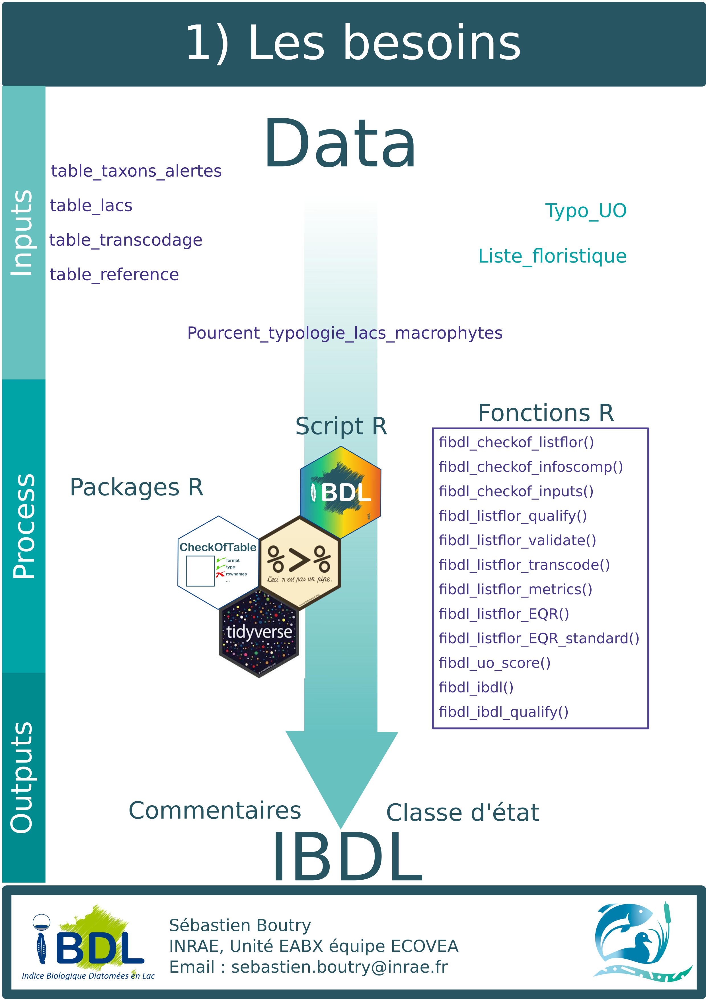

<!-- README.md is generated from README.Rmd. Please edit that file -->

# Indice Biologique Diatomées en Lac (IBDL) 

<!-- badges: start -->

[](https://www.tidyverse.org/lifecycle/#maturing)
[](commits/master)
[](https://www.gnu.org/licenses/gpl-3.0.en.html)
<!-- [](https://github.com/SebastienBoutry/IBDL/actions) -->
<!-- badges: end -->

# Installation de `{IBDL}`

La version du paquet `{IBDL}` peut se télécharger via le site Github
pour cela on aura besoin du paquet `{remotes}`:

``` r
remotes::install_github("SebastienBoutry/IBDL")
```

*NB : Le logiciel RTools est parfois nécessaire sur les machines Windows
pour pouvoir installer le package `{remotes}`, puisque l’installation
ici se fait depuis un dépôt de développement (Github) et non un dépôt
officiel R. Vous pouvez l’installer ici :
[Rtools](https://cran.r-project.org/bin/windows/Rtools/)*

Une fois installé, vous pouvez charger le package avec :

``` r
library(IBDL)
```

# Objectif

L’objectif de ce package `{IBDL}` est de fournir les fonctions
nécessaires pour calculer l’Indice Biologique Diatomées en Lac.

*NB : L’IBDL a été développé par l’équipe ECOVEA (INRAE, unité EABX)
dans le projet Phytobenthos plan d’eau financé par l’OFB-Pôle ECLA.*

# Utilisation

Le package `{IBDL}` sert à calculer l’indice biologique diatomées en lac
afin de donner une valeur et une classe d’état écologique du plan d’eau
étudié (conforme à la Directive Cadre Européenne sur l’Eau (Directive
2000)).

Dans le rapport suivant (Boutry et al. 2021) décrit la démarche
scientifique mis en place pour la création de l’IBDL.

## Les besoins

En utilisant le protocole d’échantillonnage (Morin et al. 2018), on
importe deux fichiers :

-   le premier contient les listes floristiques (id\_prelevement,
    taxons, ab),
-   le second renseigne sur les données de contexte liées au site
    d’étude (id\_prelevement, id\_uo, nature\_substrat, code\_gene,
    date).

### Données internes embarquées

Les jeux de données internes embarquées correspondent aux jeux de
données dit de référence. Ils sont décrits ci-dessous :

**`table_transcodage`** : Table de transcodage permettant de faire
correspondre le code\_taxon 4 lettres (type OMNIDIA) à son entité
taxonomique qui a été considérée pour la construction de l’IBDL. Le
choix pour l’indice est d’harmoniser les taxons à un rang taxonomique de
l’espèce. On a pris en compte la synonymie et l’héritage taxonomique.

Dans l’extrait ci-dessous, les deux premières colonnes correspondent au
code taxon et le nom scientifique associé. Les trois dernières colonnes
sont les informations définies lors de la construction de l’indice. Le
rang taxonomique à l’espèce a été ciblé. Le tableau ci-dessous
correspond à tous les taxons ayant un code taxon (indice) pour valeur
CBCU (*Cymbopleura cuspidata*).


**`table_taxons_alertes`** Table binaire indiquant si le taxon est
considéré comme indiciel et/ou d’alerte selon les paramètres (DBO5, MES,
NKJ et Ptot).


**`table_reference`**


**`table_lacs`** Table regroupant les informations sur la classification
des lacs selon l’alcalinité et le nombre théoriques d’unités
d’observation à échantillonner sur le plan d’eau selon leur superficie
(Afnor 2010).

Les classes d’alcalinité des plans d’eau sont définis comme ceci :

-   LA : alcalinité &lt;0.2 meq.l-1;
-   MA : 0.2 meq.l-1 &lt; alcalinité &lt; 1 meq.l-1;
-   HA : alcalinité &gt;1 meq.l-1.


<div align="center">



</div>

## Les étapes

On trouvera les fonctions utiles selon le cheminement (-ref-) afin
d’évaluer la qualité écologique de la masse d’eau à partir des
communautées de diatomées benthiques.

Certaines fonctions permettent de :

-   harmoniser les données,
-   qualifier/valider les données ou les métriques,
-   calculer les métriques selon un grain spatial (prélèvement, unité
    d’observation et lac).

Toutes les fonctions seront détaillées dans la vignette du package.

<div align="center">


</div>

# Contact

<div align="center">

   :e-mail:
[Email](mailto:sebastien.boutry@inrae.fr)   \|   :speech\_balloon:
[Twitter](https://twitter.com/SebBoutry)   \|   :necktie:
[LinkedIn](https://www.linkedin.com/in/s%C3%A9bastien-boutry-4a77ba10/)

<!--
Quick Link
-->

</div>

# Références

ref article ref rapport OFB

<div id="refs" class="references csl-bib-body hanging-indent">

<div id="ref-afnorXP" class="csl-entry">

Afnor. 2010. “XP T90-328 Qualité de l’eau Echantillonnage Des
Communautés de Macrophytes En Plans d’eau.”

</div>

<div id="ref-Boutry2021" class="csl-entry">

Boutry, Sébastien, Soizic Morin, Vincent Bertrin, and Juliette Rosebery.
2021. “Évaluation écologique Des Plans d’eau Basée Sur Les Communautés
de Diatomées Benthiques.” INRAE, UR EABX, équipe ECOVEA.

</div>

<div id="ref-directive2000water" class="csl-entry">

Directive, Water Framework. 2000. “Water Framework Directive.” *Journal
Reference OJL* 327: 1–73.

</div>

<div id="ref-Morin2018" class="csl-entry">

Morin, Soizic, Damien Valade, Juliette Rosebery, and Vincent Bertrin.
2018. “Echantillonnage Des Communautés de Phytobenthos En Plans d’eau.”
Technical report. Irstea.

</div>

</div>
