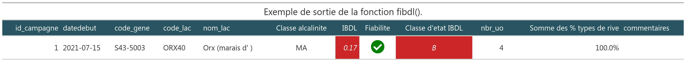

---
bibliography: vignettes/bibliography.bib
output: 
  github_document:
    df_print: kable
---

<!-- README.md is generated from README.Rmd. Please edit that file -->

```{r setup, include = FALSE}
knitr::opts_chunk$set(
  collapse = TRUE,
  comment = "#>",
  fig.path = "man/figures/README-",
  out.width = "100%"
)
```
```{r packages, message = FALSE, warning=FALSE, echo = FALSE}
# Chargement des packages
library(tidyverse)
library(here)
library(gt)
```


# Indice Biologique Diatomées en Lac (IBDL) 

<!-- badges: start -->
[](https://www.tidyverse.org/lifecycle/#maturing)
[](commits/master)
[](https://www.gnu.org/licenses/gpl-3.0.en.html)
<!-- [](https://github.com/SebastienBoutry/IBDL/actions) -->
<!-- badges: end -->


# Installation de `{IBDL}`

La version du package `{IBDL}` peut se télécharger via le site Github pour cela on aura besoin du package `{remotes}`: 

```{r install, eval=FALSE}
remotes::install_github("SebastienBoutry/IBDL")
```

_NB : Le logiciel RTools est parfois nécessaire sur les machines Windows pour pouvoir installer le package `{remotes}`, puisque l'installation ici se fait depuis un dépôt de développement (Github) et non un dépôt officiel R. Vous pouvez l'installer ici : [Rtools](https://cran.r-project.org/bin/windows/Rtools/)_

Une fois installé, vous pouvez charger le package avec :

```{r echo=TRUE}
library(IBDL)
```

# Objectif

L'objectif de ce package `{IBDL}` est de fournir les fonctions nécessaires pour calculer l'Indice Biologique Diatomées en Lac.


_NB : L'IBDL a été développé par l'équipe ECOVEA (INRAE, unité EABX) dans le projet Phytobenthos plan d'eau financé par l'OFB-Pôle ECLA._

# Utilisation

Le package `{IBDL}` sert à calculer l'Indice Biologique Diatomées en Lac (IBDL) afin de donner une valeur et une classe d'état écologique au plan d'eau étudié (conforme à la Directive Cadre Européenne sur l'Eau [@Directive2000]).

_NB Dans le rapport scientifique [@Boutry2021], les différentes étapes de la construction de l'IBDL y est décrite._

## Les besoins 

L'Indice Biologique Diatomées en Lac s'appuie sur un protocole d'échantillonnage décrit dans [@morin:hal-02594105] et dans la norme macrophytes plan d'eau [@afnorXP].

Afin d'être réprésentatif de la masse d'eau, plusieurs stations sont échantillonnés (échantillonnage stratifiée). La deuxième étape de retranscription sur des fichiers standardisés facilite l'alimentation des bases des données et la troisième étape consiste au calcul de l'indice.

### Protocole d'échantillonnage

Plusieurs stations (ou unités d'observation) sont échantillonnées sur un ou deux types de substrat (minéral/dur ou végétal). Le positionnement de ces unités d'observation est décrite dans la norme macrophytes plan d'eau [@afnorXP] elle utilise la méthode de Jensen [@Jensen1977] qui a été incrémentée dans le package [`{lakemetrics}`](https://github.com/SebastienBoutry/diatomfrLake).

### Acquisition des données

Deux sources de "template" de fichiers de données sont disponibles [Hydrobio-DCE](https://hydrobio-dce.inrae.fr/) et [OFB](https://professionnels.ofb.fr/node/398). Il est conseillé d'utiliser la version OFB.

La mise en forme des fichiers peuvent se faire à l'aide du package [`{diatomfrLake}`](https://github.com/SebastienBoutry/diatomfrLake).

Des données mésologiques (au niveau de la campagne et l'unité d'observation) et des listes floristiques sont acquises sont réparties dans deux fichiers distincts :

- le premier contient les listes floristiques (id_prelevement, taxons, ab),
- le second renseigne sur les données de contexte liées au site d'étude (id_prelevement, id_uo, nature_substrat, code_gene, date).


### Données internes embarquées

Les jeux de données internes embarquées correspondent aux jeux de données dit de référence. Ils sont décrits ci-dessous :

**`table_transcodage`** : Table de transcodage permettant de faire correspondre le code_taxon 4 lettres  (type OMNIDIA) à son entité taxonomique qui a été considérée pour la construction de l'IBDL. Le choix pour l'indice est d'harmoniser les taxons à un rang taxonomique de l'espèce. On a pris en compte la synonymie et l'héritage taxonomique. 

Dans l'extrait ci-dessous, les deux premières colonnes correspondent au code taxon et le nom scientifique associé. Les trois dernières colonnes sont les informations liées à la construction de l'indice. Le tableau ci-dessous correspond à tous les taxons ayant un code taxon (indice) pour valeur CBCU (_Cymbopleura cuspidata_). 

```{r echo = FALSE, eval=FALSE}
my_tab_transcodage <- table_transcodage %>% 
  select(abre,denominations_sans_auteur.x,code_espece_boucle2,denominations_sans_auteur.y,niveau2) %>% 
   filter(code_espece_boucle2=="CBCU") %>% 
  rename("code_taxon"="abre",
         "nom scientifique"="denominations_sans_auteur.x",
         "nom scientifique (indice)"="denominations_sans_auteur.y",
         "code_taxon (indice)"="code_espece_boucle2",
         "rang taxonomique (indice)"="niveau2") %>% 
  gt() %>% 
  tab_spanner(
    label = "Harmonisation indicielle",
    columns = c("nom scientifique (indice)",
         "code_taxon (indice)",
         "rang taxonomique (indice)")
  ) %>% 
  tab_style(
    style = list(
      cell_fill(color = "#66C1BF"),
      cell_text(style = "italic",color="#FFFFFF")
      ),
    locations = cells_body(
      columns = c("nom scientifique (indice)",
         "code_taxon (indice)",
         "rang taxonomique (indice)")
    )
  ) %>% 
  tab_style(
    style = list(
      # cell_fill(color = "#F9E3D6"),
      cell_text(style = "italic")
      ),
    locations = cells_body(
      columns = "nom scientifique"
    )
  ) %>% 
  tab_header(
    title = md("Taxons correspondant à l'espèce _Cymbopleura cuspidata_ (CBCU)"),
    subtitle = "(extrait de la table de transcodage)"
  ) %>% 
  tab_options(column_labels.background.color ="#275662" ) %>%
   tab_source_note(
    source_note = "Table créée à partir du fichier d'Omnidia (Michel Coste)"
  )  %>%
  tab_options(table.width = pct(100))

my_tab_transcodage %>% 
  gtsave("man/figures/README-table_transcodage_ex.png", vwidth = 1500)
```

```{r, echo=FALSE}
knitr::include_graphics("man/figures/README-table_transcodage_ex.png")
```


**`table_taxons_alertes`** Table binaire indiquant si le taxon est considéré comme indiciel et/ou d'alerte selon les paramètres (DBO5, MES, NKJ et Ptot). Le nombre 1 indique si le taxon est considéré comme un taxon d'alerte.


```{r taxons alertes, echo=FALSE, eval=FALSE}
my_tab_alertes <- Table_taxons_alertes[1:6,] %>% 
  rename("code_taxon"="taxons_indiciels") %>% 
  gt() %>% 
  tab_style(
    style = list(
       cell_fill(color = "#66C1BF"),
      cell_text(style = "italic",color="#FFFFFF")
      ),
    locations = cells_body(
      columns = DBO5,
      rows = DBO5==1
    )
  ) %>% 
    tab_style(
    style = list(
       cell_fill(color = "#66C1BF"),
      cell_text(style = "italic",color="#FFFFFF")
      ),
    locations = cells_body(
      columns = MES,
      rows = MES==1
    )
  ) %>% 
    tab_style(
    style = list(
       cell_fill(color = "#66C1BF"),
      cell_text(style = "italic",color="#FFFFFF")
      ),
    locations = cells_body(
      columns = Ptot,
      rows = Ptot==1
    )
  ) %>% 
    tab_style(
    style = list(
       cell_fill(color = "#66C1BF"),
      cell_text(style = "italic",color="#FFFFFF")
      ),
    locations = cells_body(
      columns = NKJ,
      rows = NKJ==1
    )
  ) %>% 
  # tab_spanner(
  #   label = "Harmonisation indicielle",
  #   columns = c("nom scientifique (indice)",
  #        "code_taxon (indice)",
  #        "rang taxonomique (indice)")
  # ) %>% 
  tab_header(
    title = md("Table des taxons d'alertes"),
    subtitle = "(extrait des 6 premières lignes)"
  ) %>%
  tab_options(column_labels.background.color ="#275662",
              table.align="center") %>%
  tab_source_note(
    source_note = "Sortie de l'analyse Titan"
  ) %>% 
  tab_options(table.width = pct(100))

my_tab_alertes %>% 
  gtsave("man/figures/README-my_tab_alertes_ex.png", vwidth = 1500)
```

```{r, echo=FALSE}
knitr::include_graphics("man/figures/README-my_tab_alertes_ex.png")
```

**`table_reference`** table regroupant les informations afin de calculer les métriques au niveau du prélèvement pour chaque paramètre, type de substrat et la classe d'alcalinité du plan d'eau.

```{r reference, echo=FALSE, eval=FALSE}
my_tab_SES <- SES_ref_type[1:6,] %>% 
  separate("join",c("Paramètre","Classe d'alcalinité","Substrat"),sep="_") %>% 
  gt() %>% 
  tab_header(
    title = md("Table de référence."),
    subtitle = "(extrait des 6 premières lignes)"
  ) %>% 
  tab_options(column_labels.background.color ="#275662" ,
              table.align="center",
              table.width = pct(100)
              )

my_tab_SES %>% 
  gtsave("man/figures/README-my_tab_SES_ex.png", vwidth = 1500)
```
```{r, echo=FALSE}
knitr::include_graphics("man/figures/README-my_tab_SES_ex.png")
```


**`table_lacs`** Table regroupant les informations sur la classification des lacs selon l'alcalinité [@Kelly2014] et le nombre minimal théorique d'unités d'observation à échantillonner sur chaque plan d'eau selon leur superficie [@afnorXP].

Les classes d'alcalinité des plans d'eau sont définis comme ceci :

- LA (basse) : alcalinité <0.2 meq.l-1; 
- MA (moyenne) : 0.2 meq.l-1 <= alcalinité < 1 meq.l-1; 
- HA (haute) : alcalinité alcalinité >=1 meq.l-1.


```{r lacs, echo=FALSE, eval=FALSE}
my_tab_lacs <- lake_infos[1:6,] %>% 
  rename("Classe d'alcalinité"="classi_alc",
         "Nombre minimum d'UO"="nbr_uo_theo") %>% 
  gt() %>% 
   tab_header(
    title = md("Table de la classification des plans d'eau selon la typologie européenne à partir de l'alcalinité."),
    subtitle = "(extrait des 6 premières lignes)"
  ) %>% 
   tab_source_note(
    source_note = "LA : low alkalinity ; MA : moderate alkalinity ; HA : higth alkalinity"
  ) %>% 
  tab_options(column_labels.background.color ="#275662",
               table.width = pct(100))
my_tab_lacs %>% 
  gtsave("man/figures/README-my_tab_lacs_ex.png", vwidth = 1500)
```

```{r, echo=FALSE}
knitr::include_graphics("man/figures/README-my_tab_lacs_ex.png")
```

<div align="center">

```{r, echo=FALSE, out.width = "600px"}
knitr::include_graphics("man/figures/1_script_IBDL_besoins.png")
```

</div>


## Les étapes

On trouve 10 fonctions dans ce package. L'une d'elle **fibdl** est une fonction intégratrice (utilisant les 9 autres) afin de définir l'indice IBDL.
Il est possible de faire une seule partie du cheminement afin de d'avoir les résultats intermédiaires à différentes échelles spatiales.

```{r ibdl, echo=TRUE, eval=FALSE}
# ## Chargement du package
# if(!require("remotes")) {install.packages("remotes")} 
# remotes::install_github("SebastienBoutry/IBDL",force = TRUE)
# library(IBDL)

## Chemins
chemin_flore <- system.file("listflor.csv", package = "IBDL") # A remplacer par votre chemin
chemin_uo <- system.file("info_uo.csv", package = "IBDL") # A remplacer par votre chemin

### Si besoin d'aide pour les chemins, dé-commenter et exécuter ces lignes à la place pour sélectionner les fichiers via une fenêtre de dialogue
# chemin_flore <- rstudioapi::selectFile()
# chemin_uo <- restudioapi::selectFile()

## Import
listflor <- read.csv2(chemin_flore, fileEncoding = "utf-8")
info_uo <- read.csv2(chemin_uo, fileEncoding = "utf-8")

## Calcul de l'IBDL
ibdl <- fibdl(listflor,info_uo)

## Affichage des résultats
ibdl

```

```{r, echo=FALSE, eval=FALSE}
## Chemins
chemin_flore <- system.file("listflor.csv", package = "IBDL") # A remplacer par votre chemin
chemin_uo <- system.file("info_uo.csv", package = "IBDL") # A remplacer par votre chemin

### Si besoin d'aide pour les chemins, dé-commenter et exécuter ces lignes à la place pour sélectionner les fichiers via une fenêtre de dialogue
# chemin_flore <- rstudioapi::selectFile()
# chemin_uo <- restudioapi::selectFile()

## Import
listflor <- read.csv2(chemin_flore, fileEncoding = "utf-8")
info_uo <- read.csv2(chemin_uo, fileEncoding = "utf-8")

## Calcul de l'IBDL
ibdl <- fibdl(listflor,info_uo)


# values=c("HG"="royalblue3", "G"="springgreen3", "M"="gold","P"= "darkorange","B"= "firebrick3")
values <- c("HG"="#0072B2", "G"="#009E73", "M"="#F0E442","P"= "#E69F00","B"= "#D55E00")
## Affichage des résultats
my_tab_lacs <- ibdl%>% 
  gt() %>% 
   tab_header(
    title = md("Exemple de sortie de la fonction fibdl_ibdl()."),
    # subtitle = "(extrait des 6 premières lignes)"
  ) %>% 
  tab_style(
  style = list(
     cell_fill(color = "royalblue3"),
    cell_text(style = "italic",color="#FFFFFF")
    ),
  locations = cells_body(
    columns = IBDL,
    rows = IBDL>=0.8
  )
  ) %>%
    tab_style(
  style = list(
     cell_fill(color = "springgreen3"),
    cell_text(style = "italic",color="#FFFFFF")
    ),
  locations = cells_body(
    columns = IBDL,
    rows = between(IBDL,right = 0.8,left = 0.6)
  )
  ) %>%
      tab_style(
  style = list(
     cell_fill(color = "gold"),
    cell_text(style = "italic",color="#FFFFFF")
    ),
  locations = cells_body(
    columns = IBDL,
    rows = between(IBDL,right = 0.6,left = 0.4)
  )
  ) %>%
    tab_style(
  style = list(
     cell_fill(color = "darkorange"),
    cell_text(style = "italic",color="#FFFFFF")
    ),
  locations = cells_body(
    columns = IBDL,
    rows = between(IBDL,right = 0.4,left =0.2)
  )
  ) %>%
      tab_style(
  style = list(
     cell_fill(color = "firebrick3"),
    cell_text(style = "italic",color="#FFFFFF")
    ),
  locations = cells_body(
    columns = IBDL,
    rows = IBDL<0.2
  )
  ) %>% 
  tab_style(
  style = list(
     cell_fill(color = "royalblue3"),
    cell_text(style = "italic",color="#FFFFFF")
    ),
  locations = cells_body(
    columns = `Classe d'etat IBDL`,
    rows = `Classe d'etat IBDL`=="HG"
  )
  ) %>%
    tab_style(
  style = list(
     cell_fill(color = "springgreen3"),
    cell_text(style = "italic",color="#FFFFFF")
    ),
  locations = cells_body(
    columns = `Classe d'etat IBDL`,
    rows = `Classe d'etat IBDL`=="G"
  )
  ) %>%
      tab_style(
  style = list(
     cell_fill(color = "gold"),
    cell_text(style = "italic",color="#FFFFFF")
    ),
  locations = cells_body(
    columns = `Classe d'etat IBDL`,
    rows = `Classe d'etat IBDL`=="M"
  )
  ) %>%
    tab_style(
  style = list(
     cell_fill(color = "darkorange"),
    cell_text(style = "italic",color="#FFFFFF")
    ),
  locations = cells_body(
    columns = `Classe d'etat IBDL`,
    rows =`Classe d'etat IBDL`=="P"
  )
  ) %>%
      tab_style(
  style = list(
     cell_fill(color = "firebrick3"),
    cell_text(style = "italic",color="#FFFFFF")
    ),
  locations = cells_body(
    columns = `Classe d'etat IBDL`,
    rows = `Classe d'etat IBDL`=="B"
  )
  ) %>% 
  tab_options(column_labels.background.color ="#275662",
               table.width = pct(100))
my_tab_lacs %>% 
  gtsave("man/figures/README-ibdl_ex.png", vwidth = 1500)
```

```{r, echo=FALSE}

```

<!-- Certaines fonctions permettent de :  -->

<!-- - harmoniser les données, -->
<!-- - qualifier/valider les données ou les métriques, -->
<!-- - calculer les métriques selon un grain spatial (prélèvement, unité d'observation et lac). -->

Toutes les fonctions sont détaillées dans la vignette du package.


<div align="center">

```{r, echo=FALSE, out.width = "600px"}
knitr::include_graphics("man/figures/2_phases_programmation.png")
```

</div>

# Contact

<div align="center">

&nbsp;&nbsp;&nbsp;:e-mail: [Email][Email]&nbsp;&nbsp;&nbsp;|&nbsp;&nbsp;&nbsp;:speech_balloon: [Twitter][Twitter]&nbsp;&nbsp;&nbsp;|&nbsp;&nbsp;&nbsp;:necktie: [LinkedIn][LinkedIn]

<!--
Quick Link
-->
[Twitter]:https://twitter.com/SebBoutry
[LinkedIn]:https://www.linkedin.com/in/s%C3%A9bastien-boutry-4a77ba10/
[Email]:mailto:sebastien.boutry@inrae.fr


</div>

# Références


