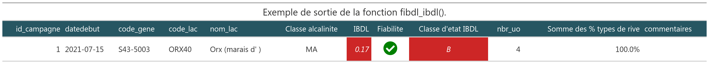

```{r setup, include = FALSE}
knitr::opts_chunk$set(
  collapse = TRUE,
  comment = "#>",
  fig.path = "man/figures/README-",
  out.width = "100%"
)
```


```{r, message = FALSE, warning=FALSE, echo = FALSE}
library(magrittr)
library(tidyverse)
library(gt)
library(IBDL)
```

# Le jeu de données test

Pour faciliter la prise en main du package, un jeu de données est mis à disposition pour faire tourner les différentes fonctions.

Il représente une campagne d'échantillonage sur un plan d'eau donné à l'aide du protocole [@morin:hal-02594105].

```{r importation, echo = FALSE}
## Chemins
chemin_flore <- system.file("listflor.csv", package = "IBDL") # A remplacer par votre chemin
chemin_uo <- system.file("info_uo.csv", package = "IBDL") # A remplacer par votre chemin

### Si besoin d'aide pour les chemins, dé-commenter et exécuter ces lignes à la place pour sélectionner les fichiers via une fenêtre de dialogue
# chemin_flore <- rstudioapi::selectFile()
# chemin_uo <- restudioapi::selectFile()

## Import
listflor <- read.csv2(chemin_flore, fileEncoding = "utf-8")
info_uo <- read.csv2(chemin_uo, fileEncoding = "utf-8")
```

## Les listes floristiques

```{r, echo=FALSE}
head(listflor)
```


## Les informations complémentaires sur la station 

# Les fonctions du package IBDL

## Au niveau du prélèvement

### Harmonisation taxonomique de la liste floristique - **fibdl_listflor_transcode**

A partir d'une liste floristique diatomique, on harmonise la dénomination de la flore au rang taxonomique de l'espèce.

Nous avons construis une table de transcodage à partir du fichier d'Omnidia (Michel Coste) de Mars 2020.
On prend en compte :

- l'évolution taxonomique 
- la synonymie
- et l'héritage (les rangs taxonmiques inférieurs à l'espèce sont remontés à ce niveau)

Selon Omnidia (date) :

*Achnanthes abundans var. elliptica* a pour nom valide *Psammothidium abundans var. ellipticum*
*Actinocyclus tenellus*(ACTE) a pour nom valide *Actinocyclus octonarius var. tenellus*


```{r fibdl_listflor_transcode,echo=FALSE}
# listflor <- tibble::tibble(id_prelevement=rep(1,16),
#                            taxons=c("AMID","ADPA","ABAS","PBTH","PHAO","PSDG","NXDS","GLAT","DSTE","RABB","COCE","ENCM","PSBR","PLTD","ADEU","AUPU"),
#                            ab=c(202,20,2,26,12,5,6,74,5,2,3,3,15,10,5,20))

# listflor <- tibble::tibble(id_prelevement=c(314,314,314,314,314,314,314,314,314,314,314,314,314,314,314,314,314,314,314,314,314,314,314,314,314,314,314,314,314,314,314,315,315,315,315,315,315,315,315,315,315,315,315,315,315,315,315,315,315,315,315,315,315,316,316,316,316,316,316,316,316,316,316,316,316,316,316,316,316,316,316,316,316,316,316,316,316,316,316,316,316,316,316,316,316,316,317,317,317,317,317,317,317,317,317,317,317,317,317,317,317,317,317,317,317,317,317,317,317,317,317,317,317,317,317,317,317,317,317,317,317,317,317,317,317,317,317,317,317,317,317,318,318,318,318,318,318,318,318,318,318,318,318,318,318,318,318,318,318,318,318,318,318,318,318,318,318,318,318,318,318,318,318,318,318,318,318,318,319,319,319,319,319,319,319,319,319,319,319,319,319,319,319,319,319,319,319,319,319,319,319,319,319,319,319,319,319,319,319,320,320,320,320,320,320,320,320,320,320,320,320,320,320,320,320,320,320,320,320,320,320,320,320,320,320),
#                             taxons=c('AAMB','ADEG','ADMI','ALFF','APED','AUAJ','AUGR','AUPU','CMED','CMEN','DPST','ENMI','ESLE','EUNO','FCVA','FPEC','GANG','GAUR','GMIN','GPAR','NACI','NADA','NCPL','NCTE','NIGR','NPAL','NPML','NSUA','RABB','SPUP','STRU','AAMB','ADCS','ADMI','AMUZ','AUAJ','AUGR','CMED','ENMI','EOMI','FRAG','GBOB','GPAR','NAGN','NCPL','NCRY','NDIS','NFIL','NIGR','NPAL','NPML','NSIA','STRU','AAMB','ADEG','ADMI','ALFF','AMUZ','AUAJ','AUPU','CMED','CMEN','ENMI','EOMI','ESBM','ESLE','FPEC','GAUR','GBOB','GMIN','GPAR','MPMI','NACI','NCRY','NCTE','NIGR','NIVA','NPAL','NPML','NSIA','NSUA','NVEN','SBRV','SPUP','SSEM','STRU','AAMB','ACOP','ADEU','ADRI','ALFF','APED','AUAJ','AUGR','AUPU','CEUG','CMED','ENMI','ENNG','EOMI','ESBM','FCVA','FPEC','FPIN','GBOB','GMIN','GPAR','GPRI','KOBG','MPMI','MVAR','NAGN','NAMP','NANT','NCPL','NCRY','NCTE','NDIS','NGRE','NIGR','NINC','NPAL','NPML','NRCH','NSTS','NTPT','PLFR','PTDE','RSIN','SSVE','STRU','AAMB','ADMI','AMUZ','AUAJ','AUGR','AUPU','CCOS','CMED','CMEN','DPST','DSTE','ENMI','EOMI','ESLE','ESUM','FCVA','FDEL','FPEC','FRAG','GBOB','GMIN','GOMP','GPAR','GPRI','MVAR','NACI','NCPL','NIGR','NPAD','NPAL','NPML','NSIA','NSUA','PLHU','SEXG','SSLE','STRU','AAMB','ADEU','ADMI','AMUZ','AUAJ','AUGR','AUPU','CDUB','CMED','ENMI','ESLE','EUNO','FCVA','FPIN','FPRU','FRAG','GMIN','GOMP','GPAR','NACI','NCPL','NIGR','NINT','NPAD','NPAL','NPML','NSUA','PINU','SPUP','SSLE','STRU','AAMB','ADMI','AUAJ','AUPU','CMED','CMEN','EMIN','ENMI','ESLE','EUNO','FRUM','GAUR','GBOB','GMIN','GOMP','GPAR','MVAR','NACI','NCRY','NIGR','NPAD','NPAL','NPML','NSUA','SPUP','STRU'),
# ab=c(17,1,3,1,2,69,7,42,62,6,2,8,2,2,17,4,2,1,2,6,1,2,6,1,2,2,14,5,1,2,110,2,1,9,2,17,2,8,25,4,286,4,2,2,2,2,1,1,1,12,7,1,11,1,3,11,6,5,52,2,16,5,8,132,1,28,6,2,11,2,1,15,11,13,4,1,3,2,13,4,6,2,1,4,6,25,3,2,2,1,4,12,22,1,6,4,13,59,2,5,18,4,19,4,23,13,12,3,4,6,5,1,2,2,2,4,2,1,1,1,29,26,2,2,47,1,2,2,6,1,19,3,7,1,31,1,10,2,8,7,5,2,16,1,38,1,4,2,15,64,4,10,29,7,3,1,41,6,19,1,51,2,5,6,2,1,1,1,5,1,2,3,48,1,13,1,12,15,41,3,3,1,6,8,4,60,23,18,2,3,1,11,81,2,9,2,2,1,19,5,1,22,15,11,1,8,9,25,5,2,4,6,2,179,46,1,15,3,1,1,24,2,4,2,14)
# ) 
# 
# info_uo <- tibble(id_prelevement=c(314:320),
#                   id_uo=c(224:226,226,227:229),
#                   nature_substrat=c(rep("végétal",2),"mineral",rep("végétal",4)),
#                   id_campagne=1,
#                   type_dominant=c(2,rep(4,4),1,1),
#                   code_pe="ORX40",
#                   datedebut="2021-07-15")


listflor %>% 
  left_join(IBDL:::table_transcodage,by=c("taxons"="abre")) %>% 
  rename("nom_scientifique"="denominations_sans_auteur.x") %>% 
  select(id_prelevement,taxons,nom_scientifique,ab) %>% 
  # arrange(taxons)  %>% 
  filter(id_prelevement==314) %>% 
  # head() %>% 
  gt()

fibdl_listflor_transcode(listflor) %>% 
  rename("nom_scientifique (transcode)"="denominations_sans_auteur.y",
         "rang_taxonomique (transcode)"="rang") %>% 
     filter(id_prelevement==314) %>% 
  gt()
```

## Validation des listes floristiques - **fibdl_listflor_validate**

### Qualification - **fibdl_listflor_qualify**


```{r}

```


###  Calcul des métriques au niveau de la liste floristique

#### - **fibdl_listflor_metrics**
#### - **fibdl_listflor_EQR**
#### - **fibdl_listflor_EQR_standard**

## Au niveau de l'unité d'observation 

### Score au niveau de l'unité d'observation - fibdl_uo_score

## Au niveau du lac 

### Calcul de l'IBDL au niveau du lac - **fibdl**

#### - **fibdl_ibdl**

A partir du jeu de sortie de la fonction **fibdl_uo_score**, la fonction **fibdl_ibdl()** calcule l'Indice Biologique Diatomées en Lac et la fournit la classe d'état du plan d'eau.


#### - **fibdl_ibdl_qualify**

La fonction **fibdl_ibdl_qualify** détermine la qualité de l'évaluation, si celle la est représentative du plan d'eau.

Deux critères sont pris en compte à ce niveau la :

- au moins 3 unités d'observation possèdent un score au nivau de l'UO,
- plus de 75% de type de rive est représenté.

# La fonction intégratrice  - **fibdl**

```{r ibdl, echo=TRUE, eval=FALSE}
## Calcul de l'IBDL
ibdl <- fibdl(listflor,info_uo)

## Affichage des résultats
ibdl
```

Après un mise en forme à l'aide du package `{gt}`, on obtient le résultat suivant :

```{r, echo=FALSE}

```


```{r}

```

# Référence
